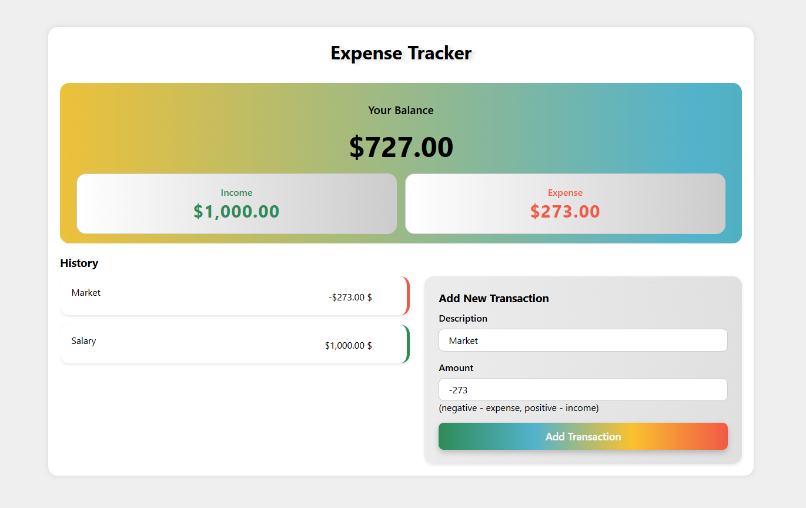

# Expense Tracker

This is a simple Expense Tracker web application that helps you track your expenses.

## Project Structure

- `index.html`: The main HTML file that contains the structure of the app.
- `style.css`: The CSS file that styles the app's interface.
- `script.js`: The JavaScript file that contains the app's functionality.

## How to Use

1. Open the `index.html` file in any modern web browser.
2. Use the interface to add, view, and manage your expenses.

## Features

- Add new expense entries.
- View the list of expenses.
- Simple and intuitive user interface.

## Used Technologies

- HTML
- CSS
- JavaScript

## Project Screenshot

